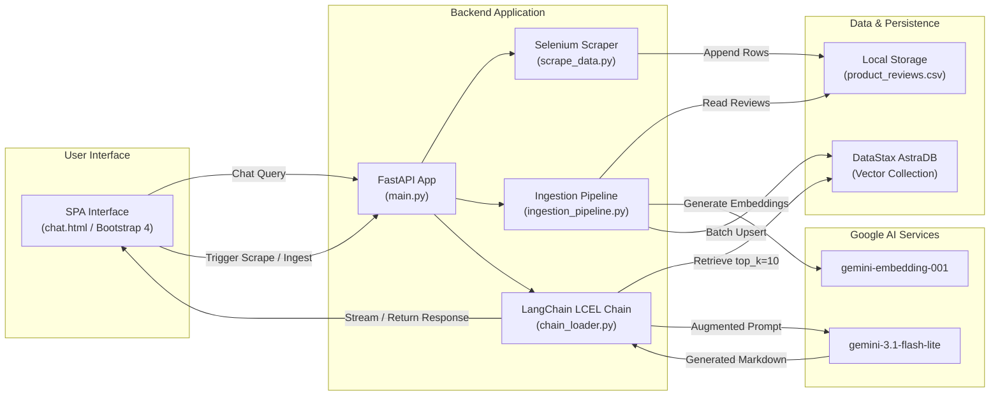

# ShopBuddy


A Retrieval-Augmented Generation (RAG) assistant and automated data pipeline that extracts live e-commerce product reviews from Flipkart, indexes them into a DataStax AstraDB vector store, and delivers grounded product insights via Google Gemini.

---

## Table of Contents

- [Overview](#overview)
- [System Architecture](#system-architecture)
- [Tech Stack](#tech-stack)
- [Repository Structure](#repository-structure)
- [Getting Started](#getting-started)
- [Running with Docker](#running-with-docker)
- [Data Pipeline Workflows](#data-pipeline-workflows)
- [API Reference](#api-reference)
- [Configuration Reference](#configuration-reference)
- [Google Cloud Run Deployment](#google-cloud-run-deployment)
- [CI/CD Pipeline](#cicd-pipeline)
- [Contributing](#contributing)
- [Author](#author)

---

## Overview

ShopBuddy bridges automated web data extraction with retrieval-augmented generation. The system extracts review data directly from Flipkart listings using browser automation, creates vector embeddings using Google Generative AI, stores them in DataStax AstraDB, and serves an interactive single-page application (SPA) powered by FastAPI.

### Core Capabilities

- **RAG-Powered Conversational Engine**: LangChain Expression Language (LCEL) chain (`Retriever -> Prompt Template -> LLM -> StrOutputParser`) executing semantic vector search (`top_k: 10`) across review embeddings.
- **Automated Web Scraping**: Headless review extraction using `undetected-chromedriver` and BeautifulSoup4 with dynamic product pagination, review parsing, and anti-bot mitigation.
- **Batch Vector Ingestion**: Deduplication mechanism generating deterministic document IDs (MD5 hashes/product IDs) with rate-limit handling (50 documents per batch).
- **Single-Page Web Portal**: Jinja2-rendered interface providing real-time vector search exploration, chat UI with suggestion chips, and dataset management.
- **Cloud-Native Deployment**: Multi-stage Dockerized FastAPI application configured for GCP Cloud Run with automated GitHub Actions CI/CD and deployment-environment feature gating.

---

## System Architecture



---

## Tech Stack

| Layer | Component | Details |
|---|---|---|
| **Runtime & Language** | Python | 3.11 (`python:3.11-slim`) |
| **API Framework** | FastAPI | Async ASGI framework served by Uvicorn |
| **LLM & Embeddings** | Google Gemini | `gemini-3.1-flash-lite` (Inference), `gemini-embedding-001` (Embeddings) |
| **RAG Orchestration** | LangChain | `langchain-core`, `langchain-google-genai`, `langchain-astradb` (LCEL) |
| **Vector Database** | DataStax AstraDB | Cassandra-backed serverless vector database (`shopbuddy` collection) |
| **Scraper** | Selenium + BS4 | `undetected-chromedriver` with Windows Registry Chrome auto-detection |
| **Frontend** | Jinja2 + Bootstrap | Bootstrap 4.1.3, jQuery 3.3.1, `marked.js`, Inter Typography |
| **Infrastructure** | GCP & Docker | Google Cloud Run (`asia-south1`), Artifact Registry, GitHub Actions |

---

## Repository Structure

```
ShopBuddy/
├── .github/
│   └── workflows/
│       └── deploy.yml              # CI/CD pipeline for GCP Cloud Run
├── config/
│   ├── __init__.py
│   ├── config.yaml                 # Model parameters, collection name, top_k settings
│   └── config_loader.py            # YAML configuration loader
├── data/
│   └── product_reviews.csv         # Scraped review dataset
├── data_ingestion/
│   ├── __init__.py
│   └── ingestion_pipeline.py       # CSV to AstraDB vector ingestion module
├── data_scraper/
│   ├── __init__.py
│   └── scrape_data.py              # Flipkart automated scraping pipeline
├── notebook/
│   └── customer_support.ipynb      # Prototyping and experimentation notebook
├── prompt_library/
│   ├── __init__.py
│   └── prompt.py                   # System prompt definitions
├── retriever/
│   ├── __init__.py
│   ├── retrieval.py                # AstraDB vector retriever implementation
│   └── chain_loader.py             # LCEL execution chain builder
├── static/
│   ├── style.css                   # Client styling
│   └── *.png                       # Application static assets
├── templates/
│   └── chat.html                   # Unified SPA template
├── utils/
│   ├── __init__.py
│   └── model_loader.py             # Model instantiation for embeddings and LLM
├── .dockerignore
├── .env.example                    # Environment variable schema
├── .gitignore
├── docker-compose.yml              # Local container orchestration
├── Dockerfile                      # Multi-stage production container build
├── main.py                         # Application entrypoint
├── requirements.txt                # Production dependencies
└── setup.py                        # Package definitions and editable install configuration
```

---

## Getting Started

### Prerequisites

- **Python**: `>= 3.11`
- **Google Chrome**: Latest stable version (required for local Selenium scraping)
- **Google AI Studio API Key**: For Gemini LLM and Embedding models
- **DataStax AstraDB Account**: Token, API endpoint, and keyspace
- **Docker & Docker Compose** *(Optional)*: `>= 20.x`

### Installation

1. **Clone the repository:**
   ```bash
   git clone [https://github.com/Areeb-Ahmd/ShopBuddy.git](https://github.com/Areeb-Ahmd/ShopBuddy.git)
   cd ShopBuddy
   ```

2. **Set up a virtual environment:**
   ```bash
   python -m venv venv
   
   # Linux/macOS
   source venv/bin/activate
   
   # Windows
   venv\Scripts\activate
   ```

3. **Install dependencies:**
   ```bash
   pip install -r requirements.txt
   pip install -e .
   ```

4. **Configure environment variables:**
   ```bash
   cp .env.example .env
   ```
   Edit `.env` with your credentials:
   ```env
   GOOGLE_API_KEY="AIzaSyD..."
   ASTRA_DB_API_ENDPOINT="https://<db-id>-<region>.apps.astra.datastax.com"
   ASTRA_DB_APPLICATION_TOKEN="AstraCS:..."
   ASTRA_DB_KEYSPACE="default_keyspace"
   DEPLOYMENT_ENV="local"
   PORT="8080"
   ```

5. **Start the application:**
   ```bash
   python main.py
   # Alternatively:
   uvicorn main:app --host 0.0.0.0 --port 8080 --reload
   ```
   Access the web interface at `http://localhost:8080`.

---

## Running with Docker

### Local Orchestration with Docker Compose
```bash
docker compose up --build -d
```

### Direct Docker CLI Build
```bash
docker build -t shopbuddy .
docker run -p 8080:8080 --env-file .env shopbuddy
```

---

## Data Pipeline Workflows

> **Environment Note:** Web scraping and ingestion endpoints are operational only when `DEPLOYMENT_ENV=local`. They are gated (403 Forbidden) on cloud deployments (`DEPLOYMENT_ENV=gcp`).

### 1. Web Scraping
Scrapes product details (product ID, title, price, rating, total reviews, and customer reviews) directly from Flipkart.

- **Via Web UI**: Open `http://localhost:8080`, navigate to the **Scraper & Ingestion** tab, enter product keywords, and execute.
- **Via REST Endpoint**:
  ```bash
  curl -X POST http://localhost:8080/api/scrape \
    -H "Content-Type: application/json" \
    -d '{
      "product_inputs": ["wireless headphones", "mechanical keyboard"],
      "product_description": "budget options under 5000",
      "max_products": 5,
      "review_count": 3
    }'
  ```

### 2. Vector Store Ingestion
Converts records in `data/product_reviews.csv` into LangChain `Document` objects with metadata and batch-upserts them into AstraDB.

- **Via REST Endpoint**:
  ```bash
  curl -X POST http://localhost:8080/api/ingest
  ```
- **Via Python Module**:
  ```bash
  python -m data_ingestion.ingestion_pipeline
  ```

---

## API Reference

| Method | Route | Description | Environment Availability |
|---|---|---|---|
| `GET` | `/` | Serves unified SPA (Chatbot, Scraper, Reviews Explorer) | Local & Cloud |
| `GET` | `/health` | Health check endpoint for Cloud Run liveness probes | Local & Cloud |
| `POST` | `/get` | Queries RAG pipeline with user question and returns Markdown response | Local & Cloud |
| `GET` | `/api/reviews` | Returns all scraped reviews from CSV in JSON format | Local & Cloud |
| `POST` | `/api/scrape` | Executes Flipkart product review scraper pipeline | Local Only |
| `POST` | `/api/ingest` | Ingests local CSV records into AstraDB vector store | Local Only |
| `GET` | `/api/download` | Downloads `data/product_reviews.csv` | Local Only |

---

## Configuration Reference

Central settings are managed in `config/config.yaml`:

```yaml
astra_db:
  collection_name: "shopbuddy"         # AstraDB vector collection name

embedding_model:
  provider: "google"
  model_name: "models/gemini-embedding-001"   # Embedding model identifier

retriever:
  top_k: 10                            # Number of retrieved context chunks

llm:
  provider: "google"
  model_name: "gemini-3.1-flash-lite"  # Generation LLM identifier
```

---

## Google Cloud Run Deployment

### 1. Initialize GCP Services
```bash
gcloud config set project shopbuddy-504620
gcloud services enable run.googleapis.com artifactregistry.googleapis.com secretmanager.googleapis.com cloudbuild.googleapis.com
```

### 2. Provision Artifact Registry Repository
```bash
gcloud artifacts repositories create shopbuddy-repo \
  --repository-format=docker \
  --location=asia-south1 \
  --description="ShopBuddy Docker images"
```

### 3. Store Secrets in Secret Manager
```bash
echo YOUR_GOOGLE_API_KEY | gcloud secrets create GOOGLE_API_KEY --data-file=- --replication-policy=automatic
echo YOUR_ASTRA_DB_API_ENDPOINT | gcloud secrets create ASTRA_DB_API_ENDPOINT --data-file=- --replication-policy=automatic
echo YOUR_ASTRA_DB_APPLICATION_TOKEN | gcloud secrets create ASTRA_DB_APPLICATION_TOKEN --data-file=- --replication-policy=automatic
echo YOUR_ASTRA_DB_KEYSPACE | gcloud secrets create ASTRA_DB_KEYSPACE --data-file=- --replication-policy=automatic
```

### 4. Create Service Account and Assign IAM Roles
```bash
gcloud iam service-accounts create github-actions-deployer --display-name="GitHub Actions Cloud Run Deployer"

gcloud projects add-iam-policy-binding shopbuddy-504620 --member="serviceAccount:github-actions-deployer@shopbuddy-504620.iam.gserviceaccount.com" --role="roles/run.admin"
gcloud projects add-iam-policy-binding shopbuddy-504620 --member="serviceAccount:github-actions-deployer@shopbuddy-504620.iam.gserviceaccount.com" --role="roles/artifactregistry.writer"
gcloud projects add-iam-policy-binding shopbuddy-504620 --member="serviceAccount:github-actions-deployer@shopbuddy-504620.iam.gserviceaccount.com" --role="roles/iam.serviceAccountUser"
gcloud projects add-iam-policy-binding shopbuddy-504620 --member="serviceAccount:github-actions-deployer@shopbuddy-504620.iam.gserviceaccount.com" --role="roles/secretmanager.secretAccessor"

gcloud projects add-iam-policy-binding shopbuddy-504620 --member="serviceAccount:672313940192-compute@developer.gserviceaccount.com" --role="roles/secretmanager.secretAccessor"
```

### 5. Generate Key File for CI/CD
```bash
gcloud iam service-accounts keys create key.json --iam-account=github-actions-deployer@shopbuddy-504620.iam.gserviceaccount.com
```

---

## CI/CD Pipeline

The repository includes a GitHub Actions workflow (`.github/workflows/deploy.yml`) that automatically builds and deploys the container to **Google Cloud Run** on pushes to the `main` branch.

### Required GitHub Repository Secrets

| Secret Name | Description |
|---|---|
| `GCP_SA_KEY` | Full contents of the `key.json` service account private key |
| `GCP_PROJECT_ID` | GCP Project ID (`shopbuddy-504620`) |

---

## Contributing

1. Fork the repository
2. Create a feature branch (`git checkout -b feature/your-feature-name`)
3. Commit your changes (`git commit -m 'Add feature: your-feature-name'`)
4. Push to the branch (`git push origin feature/your-feature-name`)
5. Open a Pull Request

---

## Author

- **Syed Areeb Ahmad** — [ahmad.syedareeb7@gmail.com](mailto:ahmad.syedareeb7@gmail.com)
- **GitHub**: [@Areeb-Ahmd](https://github.com/Areeb-Ahmd)
- **LinkedIn**: [areeb-ahmad7](https://www.linkedin.com/in/areeb-ahmad7)
